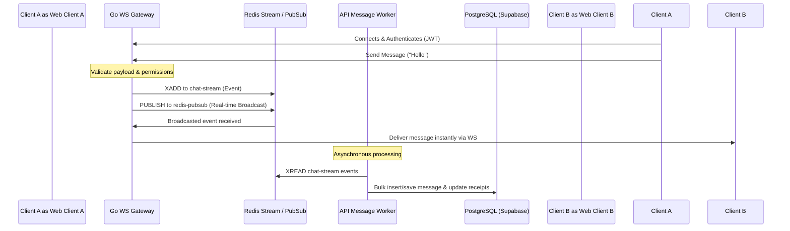

# Talka — Real-Time Chat Monorepo

Talka is a high-performance, real-time chat application built as a modern monorepo. It features instant messaging, group conversations, live user presence tracking, typing indicators, read receipts, and file attachments.

## 🏗️ System Architecture

Talka relies on a decoupled, event-driven architecture designed to scale socket connections independently from database write operations:



### Core Monorepo Services

*   **`apps/web` (Frontend Client):** Next.js 14 App Router client styled with Tailwind CSS, utilizing Zustand for client-side state management, and the Supabase JS library for client-side authentication.
*   **`apps/api` (Backend & Workers):** Node.js Express server. Exposes the REST API for historical data queries and authentication sync. Runs an in-process, asynchronous background worker (`messageWorker.ts`) that consumes events from Redis Streams to persist messages to PostgreSQL.
*   **`apps/gateway` (WebSocket Server):** High-performance Go WebSocket gateway built on `gorilla/websocket`. It maintains persistent socket connections, tracks live user statuses (online/offline) in Redis, and acts as a lightweight message broker publishing to Redis Streams.
*   **`packages/types` (Shared Types):** Unified TypeScript interfaces, type-guard utility functions, and Zod schemas shared across the frontend and backend.
*   **`packages/prisma` (Shared Database client):** Prisma schema, migrations, and generated client used by the backend API.
*   **`packages/ts-config` (Shared Configs):** Centralized TypeScript compiler configurations for Next.js, Node.js, and browser environments.

---

## ⚙️ Configuration & Environment Variables

Create local `.env` files in each workspace by using the corresponding `.env.example` templates.

### Monorepo Root / Packages (`packages/prisma/.env`)
*   `DATABASE_URL`: PostgreSQL connection string (Supabase Postgres database).

### Web Client (`apps/web/.env.local`)
*   `NEXT_PUBLIC_SUPABASE_URL`: Supabase project domain.
*   `NEXT_PUBLIC_SUPABASE_ANON_KEY`: Supabase public anonymous API key.
*   `NEXT_PUBLIC_API_URL`: REST API HTTP endpoint (defaults to `http://localhost:3001`).
*   `NEXT_PUBLIC_GATEWAY_URL`: Go Gateway WebSocket endpoint (defaults to `ws://localhost:4000`).

### API Backend (`apps/api/.env`)
*   `PORT`: HTTP listen port (defaults to `3001`).
*   `DATABASE_URL`: Connection string for PostgreSQL.
*   `REDIS_URL`: Connection string for Redis.
*   `SUPABASE_URL`: Supabase project domain.
*   `SUPABASE_SERVICE_ROLE_KEY`: Supabase server-side admin key.
*   `SUPABASE_JWT_SECRET`: JWT secret for local token validation.
*   `ENABLE_WORKER`: Set to `true` to run the Redis stream message consumer in-process.

### WebSocket Gateway (`apps/gateway/.env`)
*   `PORT`: HTTP/WS listen port (defaults to `4000`).
*   `REDIS_URL`: Redis server address (e.g. `redis://localhost:6379`).
*   `SUPABASE_JWT_SECRET`: JWT signature key to verify incoming client socket tokens.
*   `LOG_LEVEL`: Logger verbosity (`debug`, `info`, `warn`, `error`).

---

## 🚀 Local Development Setup

### Prerequisites
*   **Node.js:** v18.x or v20.x
*   **pnpm:** v8.x or newer
*   **Go:** v1.21 or newer
*   **Docker:** For running Redis locally

### 1. Install Dependencies
Initialize monorepo packages and workspaces:
```bash
pnpm install
```

### 2. Infrastructure Services (Redis)
Start the Redis container in the background:
```bash
docker-compose up -d
```

### 3. Generate Database Client
Compile and build the Prisma client wrapper:
```bash
pnpm db:generate
```

### 4. Run Development Servers
Start Next.js frontend, API Backend, and the TypeScript watcher:
```bash
pnpm dev
```

In a separate terminal tab, start the Go WebSocket gateway:
```bash
cd apps/gateway
go run main.go
```

---

## 🏗️ Production Deployment

### 1. Build TypeScript Packages
Generate production assets for Next.js, Express, and packages:
```bash
pnpm build
```

### 2. Build and Compile Go Gateway
Create a production-optimized Go binary:
```bash
cd apps/gateway
go build -o dist/gateway main.go
```

### 3. Containerization
The repository contains standalone Multi-stage `Dockerfile` manifests for all three services:
*   `apps/web/Dockerfile`: Production standalone Next.js build.
*   `apps/api/Dockerfile`: Clean Node.js environment running the compiled API & worker.
*   `apps/gateway/Dockerfile`: Lightweight Go binary runtime.
